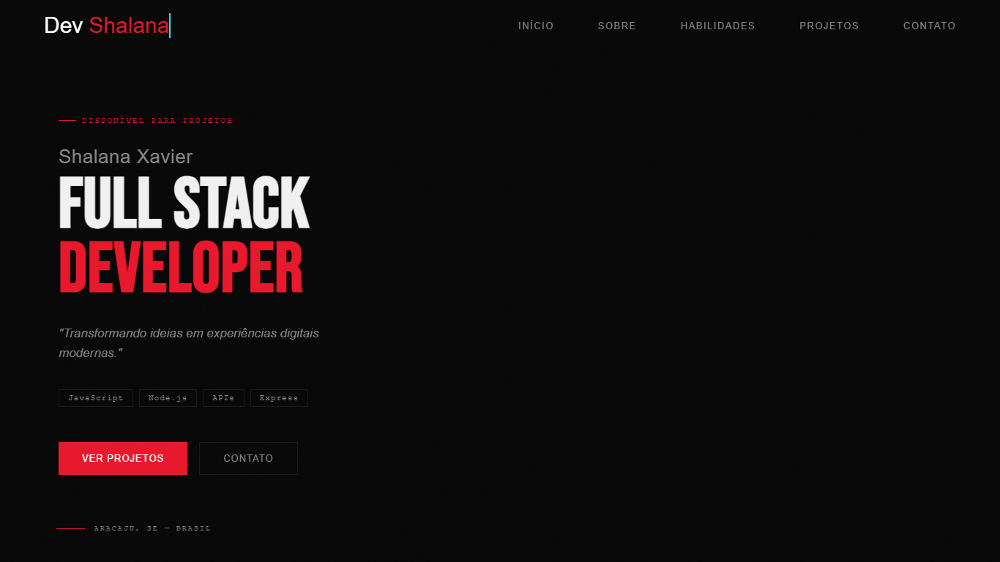
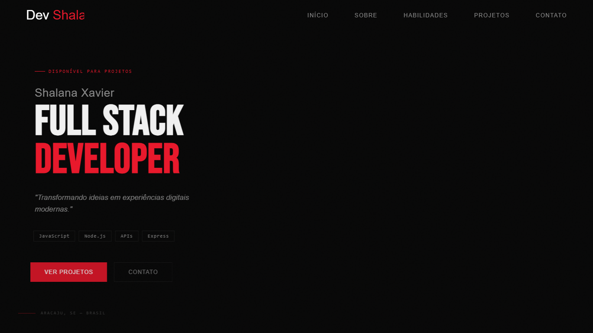
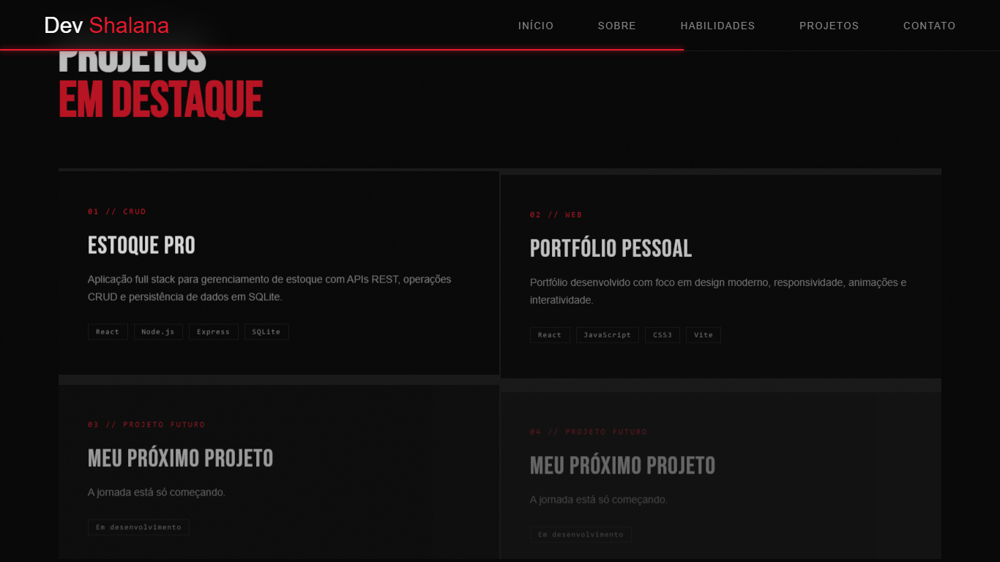
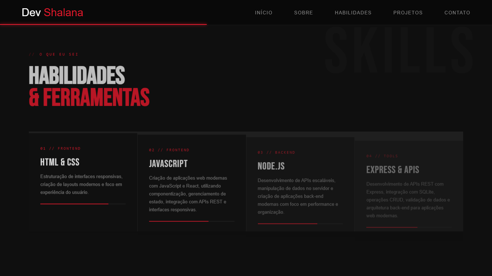
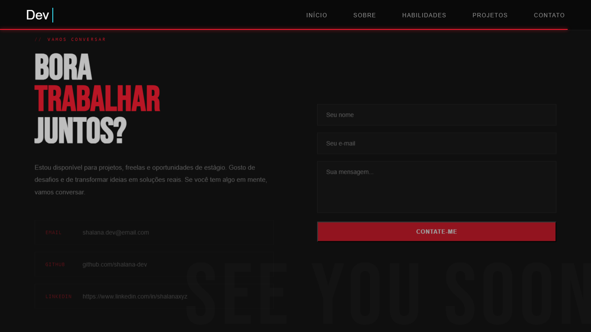
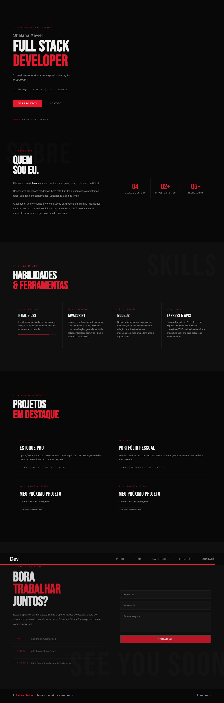

# Portfólio | Shalana Xavier

Portfólio pessoal desenvolvido com **React** e **Vite** para apresentar minha trajetória, habilidades, projetos e formas de contato como desenvolvedora Full Stack.

---

## Sobre

Site one-page com visual **dark premium**, tipografia marcante e animações suaves. O objetivo é apresentar de forma profissional quem sou, o que sei fazer e quais projetos já construí — ideal para portfólio, LinkedIn e processos seletivos.

**Autora:** Shalana Xavier  
**Localização:** Aracaju, SE — Brasil  
**GitHub:** [@shalana-dev](https://github.com/shalana-dev)

---

## Demonstração



| Hero | Projetos |
|------|----------|
|  |  |

| Habilidades | Contato |
|-------------|---------|
|  |  |



---

## Funcionalidades

- **Hero** com apresentação, tags de stack e call-to-actions
- **Sobre mim** com resumo profissional e estatísticas (estudo, projetos, tecnologias)
- **Habilidades** organizadas em cards (Frontend, JavaScript/React, Node.js, Express/APIs)
- **Projetos em destaque** com descrição e tags de tecnologia
- **Contato** com e-mail, GitHub, LinkedIn e formulário
- **Navbar fixa** com barra de progresso de scroll
- **Scroll suave** com Lenis
- **Cursor customizado** com efeito interativo no botão de contato
- **Animações de reveal** ao rolar a página (`IntersectionObserver`)
- **Layout responsivo** para mobile

---

## Tecnologias

| Categoria | Tecnologias |
|-----------|-------------|
| Frontend | React 19, JavaScript, HTML5, CSS3 |
| Build | Vite 8 |
| Animações / UX | Lenis, CSS animations, Intersection Observer |
| Bibliotecas | Framer Motion, GSAP, React Icons |
| Qualidade | ESLint |

---

## Projetos exibidos no portfólio

| Projeto | Descrição | Stack |
|---------|-----------|-------|
| **CRUD Estoque Pro** | Gerenciamento de estoque full stack com APIs REST e SQLite | React, Node.js, Express, SQLite |
| **Portfólio Pessoal** | Este site — design moderno, responsivo e interativo | React, JavaScript, CSS3, Vite |

---

## Como rodar localmente

### Pré-requisitos

- [Node.js](https://nodejs.org/) (versão LTS recomendada)
- npm

### Micropassos

1. Clone o repositório:

```powershell
git clone https://github.com/shalana-dev/portfolio-shalana-xavier.git
cd portfolio-shalana-xavier
```

2. Instale as dependências:

```powershell
npm install
```

3. Inicie o servidor de desenvolvimento:

```powershell
npm run dev
```

4. Abra no navegador o endereço que aparecer no terminal (geralmente `http://localhost:5173`).

---

## Scripts disponíveis

| Comando | O que faz |
|---------|-----------|
| `npm run dev` | Sobe o projeto em modo desenvolvimento |
| `npm run build` | Gera a versão de produção na pasta `dist/` |
| `npm run preview` | Visualiza localmente o build de produção |
| `npm run lint` | Executa o ESLint no projeto |

---

## Estrutura de pastas

```text
portfolio-shalana-xavier/
├── assets/                 # Prints e GIF de demonstração
├── public/
│   ├── eufoto.png          # Foto de perfil
│   └── logotemporaria.png  # Logo
├── src/
│   ├── components/
│   │   ├── Navbar.jsx      # Navegação e progresso de scroll
│   │   ├── Hero.jsx        # Seção inicial
│   │   ├── Sobre.jsx       # Apresentação pessoal
│   │   ├── Habilidades.jsx # Stack e competências
│   │   ├── Projetos.jsx    # Projetos em destaque
│   │   ├── Contato.jsx     # Links e formulário
│   │   └── Footer.jsx      # Rodapé
│   ├── App.jsx             # Composição das seções + reveal
│   ├── main.jsx            # Entrada React, Lenis e cursor customizado
│   ├── index.css           # Estilos globais e responsividade
│   └── App.css             # Estilos complementares
├── index.html
├── vite.config.js
├── package.json
└── README.md
```

---

## Destaques técnicos

- **Componentização:** cada seção do site é um componente React reutilizável
- **Scroll suave:** Lenis configurado em `main.jsx` com `requestAnimationFrame`
- **Cursor personalizado:** criado via DOM em `main.jsx`, com interação especial em `Contato.jsx`
- **Reveal on scroll:** `IntersectionObserver` em `App.jsx` adiciona a classe `.visible` aos elementos `.reveal`
- **Identidade visual:** paleta escura com vermelho (`#e8192c`), fontes Bebas Neue, DM Sans e JetBrains Mono

---

## Deploy

O projeto pode ser publicado em plataformas como **Vercel**, **Netlify** ou **GitHub Pages**.

Build de produção:

```powershell
npm run build
```

A pasta gerada será `dist/`.

> **Vercel (recomendado para Vite + React):** conecte o repositório GitHub, framework **Vite**, build command `npm run build`, output directory `dist`.

---

## Contato

- **E-mail:** shalana.dev@email.com
- **GitHub:** [github.com/shalana-dev](https://github.com/shalana-dev)
- **LinkedIn:** [linkedin.com/in/shalanaxyz](https://www.linkedin.com/in/shalana-dev)

---

## Melhorias futuras

- [ ] Adicionar link de demo e repositório em cada card de projeto
- [ ] Integrar envio real do formulário de contato
- [ ] Migrar para TypeScript
- [ ] Implementar tema claro (opcional)
- [ ] Publicar URL de produção no README

---

## Aprendizados

- Estruturação de SPA com React e Vite
- Organização de componentes por seção
- Animações CSS e efeitos de scroll
- Experiência de usuário com cursor customizado e microinterações
- Layout responsivo mobile-first
- Preparação de projeto para portfólio profissional

---

## Licença

Projeto pessoal — © Shalana Xavier. Todos os direitos reservados.
